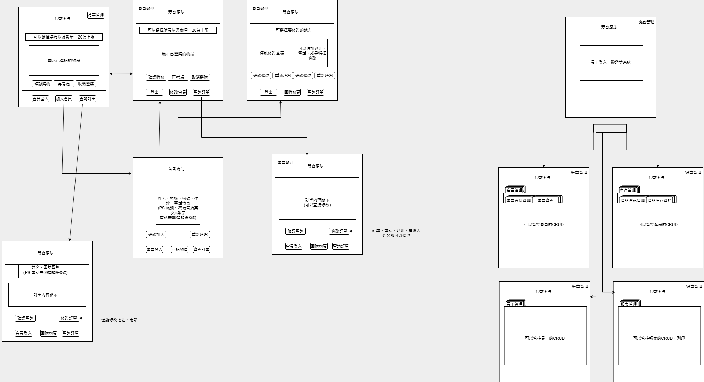

精油產品選購

🌿 探索你的芳香療癒旅程

簡單、直覺、專屬你的芳香精油體驗介面。

我們打造了一個讓你輕鬆選購、自在管理的芳香精油療法介面，將複雜簡化，讓選擇療癒的每一步，都成為日常的一部分。無論是初次體驗者，還是熱愛芳療的你，都能在這裡找到最適合自己的香氣組合與訂購節奏。

✨ UI介面特色：

快速香氛選擇：簡單幾步，依個人喜好與功效（如放鬆、提神）快速選出合適精油產品。

會員專屬功能：登入後可查看與修改上次訂單、調整精油數量、享有專屬折扣與優惠提醒。

即時訂單查詢與編輯：不論是否為會員，皆可在下單前查詢與確認選購明細，確保每一次購買都符合需求。

歷史紀錄讀取功能：會員可一鍵載入過往喜愛精油組合，節省重新搭配的時間。

簡潔自然的視覺風格：溫潤色調與直覺操作設計，讓選購過程也成為一種舒壓儀式。

🕯️ 打造屬於你的小小芳香儀式

每一次呼吸的香氣，都是對生活的療癒回應。從選擇產品到完成訂單，我們的介面陪你溫柔而準確地走好每一步。

接下來是我的設計初始化流程：

然後是我實際設計的大致目錄：

src/ 
└── main/ 
    └── java/ 
        ├── controller/ 
        │   ├── Shop.java 
        │   └── StaffSystem.java 
        │ 
        ├── dao/ 
        │   ├── MemberDao.java 
        │   ├── OrderAllDao.java 
        │   ├── OrderItemDao.java 
        │   ├── ProductDao.java 
        │   ├── ProductStockDao.java 
        │   ├── ProductSystemViewDao.java 
        │   └── StaffDao.java 
        │ 
        │   └── impl/ 
        │       ├── MemberDaoImpl.java 
        │       ├── OrderAllDaoImpl.java 
        │       ├── OrderItemDaoImpl.java 
        │       ├── ProductDaoImpl.java 
        │       ├── ProductStockDaoImpl.java 
        │       ├── ProductSystemViewDaoImpl.java 
        │       └── StaffDaoImpl.java 
        │ 
        ├── model/ 
        │   ├── Category.java 
        │   ├── Member.java 
        │   ├── OrderAll.java 
        │   ├── OrderData.java 
        │   ├── OrderItem.java 
        │   ├── Product.java 
        │   ├── ProductStock.java 
        │   ├── ProductSystemView.java 
        │   └── Staff.java 
        │ 
        ├── service/ 
        │   ├── MemberService.java 
        │   ├── OrderAllService.java 
        │   ├── OrderItemService.java 
        │   ├── ProductService.java 
        │   ├── ProductStockService.java 
        │   └── StaffService.java 
        │ 
        │   └── impl/ 
        │       ├── MemberServiceImpl.java 
        │       ├── OrderAllServiceImpl.java 
        │       ├── OrderItemServiceImpl.java 
        │       ├── ProductServiceImpl.java 
        │       ├── ProductStockServiceImpl.java 
        │       └── StaffServiceImpl.java 
        │ 
        └── util/ 
            ├── ButtonTool.java 
            ├── DbConnection.java 
            ├── FileTool.java 
            ├── OrderTool.java 
            ├── SQLTool.java 
            └── SystemTool.java 

剩下的部分可以參考我給的檔案內容來理解內容。

